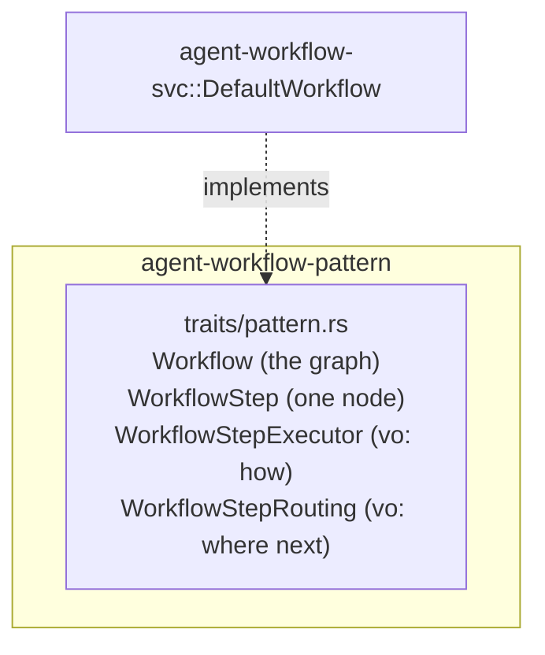

# Agent Workflow Architecture

> **Scope**: High-level overview only. Implementation details belong in the
> [Developer Guide](../4-development/developer_guide.md).

**Audience**: Developers working on `agent-workflow-pattern`, or implementing a new real
`Workflow`/`WorkflowStep`.

## WHAT

The Workflow pattern: the contract for an agent's goal-oriented, multi-step execution plan. A
`Workflow` is a directed graph of `WorkflowStep`s with conditional routing — each step declares
what to execute (a prompt), how (`WorkflowStepExecutor`), and where to route next
(`WorkflowStepRouting`) on success, failure, or condition failure.

Key capabilities:
- **`Workflow`** — id, description, step lookup by id, the full ordered step-id list, and the
  entry point (`start_step_id`).
- **`WorkflowStep`** — one step's prompt, executor type, executor-specific params, turn/iteration
  limits, and routing on complete/fail/condition-fail.
- **`WorkflowStepExecutor`/`WorkflowStepRouting`** — plain value enums; how a step runs, where a
  step goes next.

## WHY

| Problem | Solution |
|---------|----------|
| An agent needs a goal plan more structured than "keep prompting until done" | `Workflow`: an explicit graph of steps with real routing, not an implicit loop |
| A step's outcome (success, failure, a human rejecting a gate) each needs different next-step logic | `WorkflowStepRouting` gives each of the three cases (`on_complete`/`on_fail`/`on_condition_fail`) its own explicit routing |
| Different steps need genuinely different execution mechanisms (an LLM call vs. a human approval vs. dispatching to another agent) | `WorkflowStepExecutor` names the mechanism per step, open to new variants without changing `WorkflowStep`'s own shape |
| A step can legitimately loop (e.g. revise → discuss → revise again) | `max_iterations` on `WorkflowStep`, distinct from `max_turns` (per-step LLM-turn budget) |

Real example this contract models directly (from `llmboot`, this org's own prior art):

```text
propose → discuss (human_gate) → {
  approve → integrate → implement → done
  OR request_changes → revise → discuss (loop back)
}
```

## HOW

### Component Shape



Everything lives in one file, `src/traits/pattern.rs` (despite the filename, it holds the
domain's real traits, not a "Pattern" type — `src/traits/mod.rs` re-exports it flatly). `src/vo/`
exists but is empty: `WorkflowStepExecutor`/`WorkflowStepRouting` are small enough to live
alongside the traits that use them rather than in a separate file, and there is no other value
object this domain needs.

### Zero implementation, zero dependencies

Per [`pattern_svc_workflow.md`](https://github.com/sweengineeringlabs/template-engine/blob/main/pattern_svc_workflow.md)'s
"zero implementation" rule: this crate implements none of its own primary traits (`Workflow`,
`WorkflowStep`) for any concrete type. `Cargo.toml` has an empty `[dependencies]` table — no
`thiserror`, no `serde`, nothing. A real, runnable `Workflow` — `DefaultWorkflow`, a sequential
executor with in-memory step storage — lives in the companion
[`agent-workflow-svc`](https://github.com/sweengineeringlabs/agent-workflow-svc) repo, per the
pattern/svc split this org uses for every domain in the `agent-spec` family.

### Why this crate has no `vo`/`dto`/`error` folders

Every value this domain needs (`WorkflowStepExecutor`, `WorkflowStepRouting`) is small enough to
live directly in `traits/pattern.rs` next to the trait that uses it. There is no fallible
operation declared on either trait, so there is no `error/` module — a real implementor's own
construction can fail (e.g. `agent-workflow-svc`'s `WorkflowBuilder::build` returns
`Result<impl Workflow, String>`), but that is `-svc`-side behavior, not part of this contract.

## Documentation

| Document | Description |
|----------|--------------|
| [Developer Guide](../4-development/developer_guide.md) | Module structure, dev workflow, conventions |
| [agent-workflow-svc](https://github.com/sweengineeringlabs/agent-workflow-svc) | Real implementation |

---

**Status**: Stable
